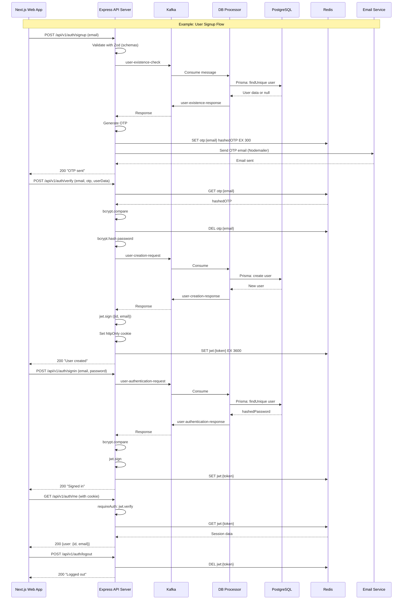

# CFD-Broker Architecture Overview

## Overall Flow Sequence Diagram

## Architecture Description

### Core Components

1. **Web App (Next.js)**: Frontend client for user interactions.
2. **API Server (Express)**: Handles HTTP requests, validation, auth, OTP, JWT.
3. **Kafka**: Async messaging for decoupling API and DB operations.
4. **DB Processor**: Consumes Kafka messages, performs DB queries via Prisma.
5. **PostgreSQL**: Relational DB for persistent user data.
6. **Redis**: In-memory cache for sessions and OTPs.
7. **Email Service**: SMTP for OTP emails (Gmail via Nodemailer).

### Shared Packages

- **Schemas (/packages/schemas)**: Zod for input validation.
- **UI (/packages/ui)**: Reusable React components.
- **Kafka (/packages/kafka)**: Shared Kafka client.
- **Redis (/packages/redis)**: Shared Redis client.
- **DB (/packages/db)**: Prisma client and migrations.
- **TypeScript Config (/packages/typescript-config)**: Shared TS settings.

### Key Design Patterns

- **Event-Driven**: Kafka for async, scalable communication.
- **Stateless API**: JWT + Redis for sessions (no server-side state).
- **Security**: bcrypt for passwords, OTP for verification, httpOnly cookies.
- **Monorepo**: Turborepo for managing packages and builds.

## Performance Notes

- **Signup**: ~3.5s (email bottleneck)
- **Signin**: ~200ms (Kafka + bcrypt)
- **Verify OTP**: ~270ms (Kafka + creation)
- **Logout /me**: <10ms (Redis ops)

## Deployment

- Containerize with Docker (separate containers for API, DBProc, Kafka, Redis).
- Use env vars for configs (DB URLs, secrets).
- Scale DBProc independently for high load.