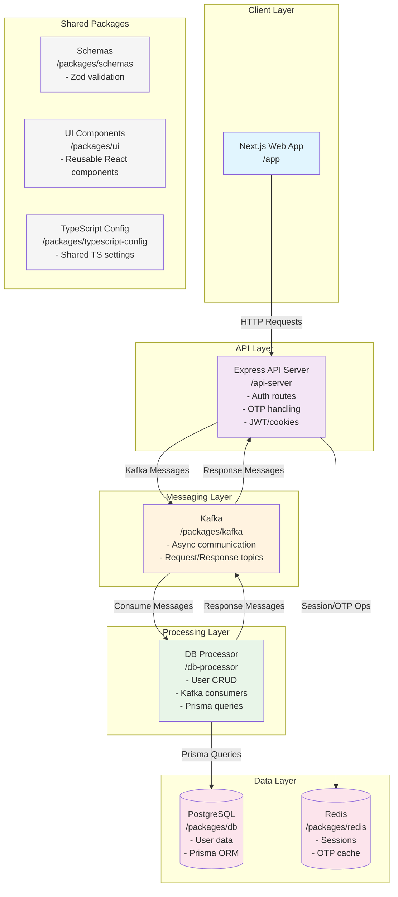

# CFD-Broker Architecture Overview

## High-Level Component Diagram

## Architecture Description

### Core Components

1. **Web App (Next.js)**: Frontend for user interactions (signup, signin, dashboard).
2. **API Server (Express)**: Handles HTTP requests, auth logic, OTP flows, JWT management.
3. **DB Processor**: Background service for database operations via Kafka (decoupled for scalability).
4. **Kafka**: Message broker for async communication between API and DB layers.
5. **PostgreSQL**: Primary database for user data (via Prisma ORM).
6. **Redis**: In-memory store for sessions, OTP cache (fast access).

### Shared Packages

- **Schemas**: Zod validation schemas for type-safe API inputs.
- **UI**: Reusable React components for consistent frontend.
- **TypeScript Config**: Shared TS settings across apps/packages.

### Data Flow Example (Signup)

1. User submits signup form → Web App → API Server
2. API validates input → Checks user existence via Kafka → DB Processor queries DB
3. If new user: Generate OTP → Store in Redis → Send email → Respond "OTP sent"
4. User verifies OTP → API validates → Creates user via Kafka → DB Processor inserts → JWT issued

### Key Benefits

- **Decoupled**: API and DB layers communicate via Kafka (no direct DB calls from API).
- **Scalable**: DB Processor can be scaled independently; Redis for fast sessions.
- **Secure**: JWT + Redis for stateless auth; bcrypt for passwords; OTP for verification.
- **Monorepo**: Turborepo manages shared packages and builds.

### Performance Characteristics

- **Signup**: ~3.5s (email bottleneck)
- **Signin**: ~200ms (Kafka + bcrypt)
- **Verify OTP**: ~270ms (Kafka + user creation)
- **Logout /me**: <10ms (Redis ops)

### Deployment Considerations

- Run API Server, DB Processor, Kafka, Redis as separate services.
- Use Docker for containerization.
- Environment variables for secrets (JWT_SECRET, DB URLs, etc.).
- Health checks for Kafka/Redis connectivity.