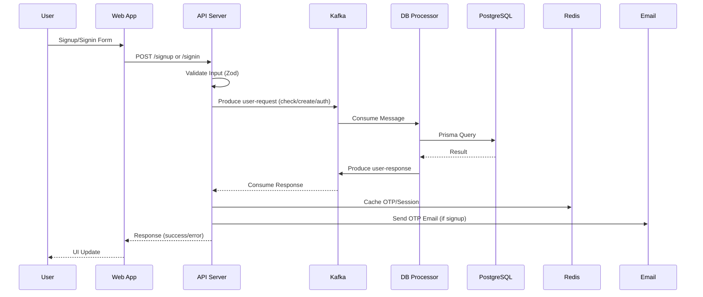
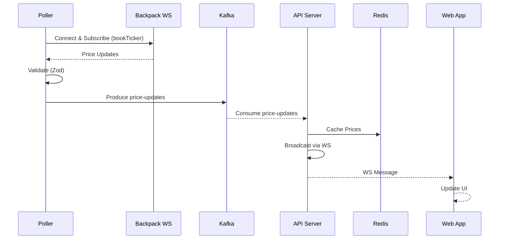

# CFD-Broker Architecture Overview

## High-Level System Architecture

CFD-Broker is a microservices-based platform for real-time CFD trading, built with a monorepo structure using Turborepo. It features event-driven architecture for scalability, with components communicating via Kafka, caching in Redis, and persistence in PostgreSQL.

### Architecture Diagram

```mermaid
graph TB
    subgraph "Client Layer"
        Web[Web App<br/>Next.js<br/>Port: 3000<br/>- User UI<br/>- WebSocket Client<br/>- Responsive Design]
    end

    subgraph "API Layer"
        API[API Server<br/>Express.js + TS<br/>Ports: 3001 (HTTP), 8080 (WS)<br/>- Auth Endpoints<br/>- Price HTTP API<br/>- WebSocket Broadcasting<br/>- Input Validation (Zod)<br/>- JWT Auth<br/>- Email OTP]
    end

    subgraph "Messaging Layer"
        Kafka[Kafka<br/>Message Broker<br/>Topics:<br/>- user-requests<br/>- user-responses<br/>- price-updates<br/>- Async decoupling]
    end

    subgraph "Processing Layer"
        DBProc[DB Processor<br/>Node.js + KafkaJS<br/>- Kafka Consumer<br/>- Prisma ORM<br/>- User CRUD<br/>- Stateless]
        Poller[Poller<br/>Node.js + WS Client<br/>- Backpack WS Connection<br/>- Price Polling<br/>- Kafka Producer<br/>- Assets: SOL, BTC, ETH, DOGE, BNB]
    end

    subgraph "Data Layer"
        DB[(PostgreSQL<br/>- User Table<br/>- Auth Data<br/>- Persistent Storage)]
        Redis[(Redis<br/>- OTP Cache<br/>- Session Tokens<br/>- Price Cache<br/>- In-Memory)]
    end

    subgraph "External Services"
        Email[Gmail SMTP<br/>- OTP Emails<br/>- Nodemailer]
        Backpack[Backpack Exchange<br/>- Real-Time Prices<br/>- WebSocket API]
    end

    Web -->|HTTP/WS| API
    API -->|Produce| Kafka
    API -->|Cache Ops| Redis
    API -->|Send OTP| Email
    Poller -->|Poll Prices| Backpack
    Poller -->|Produce| Kafka
    Kafka -->|Consume| DBProc
    DBProc -->|Read/Write| DB
    DBProc -->|Produce Responses| Kafka
    Kafka -->|Consume Responses| API
    API -->|Broadcast Prices| Web
```

### Component Responsibilities

#### Web App (`apps/web`)
- **Technology**: Next.js 14, React, TypeScript.
- **Purpose**: User-facing interface for signup, signin, OTP verification, and live price dashboard.
- **Features**:
  - Form handling with validation.
  - WebSocket integration for real-time price updates.
  - JWT token management in localStorage.
  - Responsive UI using shared `@repo/ui` components.
- **Ports**: 3000 (dev server).
- **Dependencies**: `@repo/ui`, WebSocket API.

#### API Server (`apps/api-server`)
- **Technology**: Express.js, TypeScript, WebSocket (ws library).
- **Purpose**: Central API gateway handling authentication and price services.
- **Endpoints**:
  - `POST /api/v1/signup`: User registration with OTP.
  - `POST /api/v1/signin`: Login with password.
  - `POST /api/v1/verify-otp`: OTP verification and user creation.
  - `POST /api/v1/logout`: Clear session.
  - `GET /api/v1/me`: User profile (JWT required).
  - `GET /api/v1/prices`: Latest cached prices.
- **WebSocket**: Broadcasts price updates to connected clients on port 8080.
- **Security**: bcrypt for passwords, JWT for sessions, httpOnly cookies.
- **Ports**: 3001 (HTTP), 8080 (WS).
- **Dependencies**: `@repo/kafka`, `@repo/redis`, `@repo/schemas`, Nodemailer.

#### DB Processor (`apps/db-processor`)
- **Technology**: Node.js, KafkaJS, Prisma.
- **Purpose**: Handles database operations asynchronously via Kafka.
- **Handlers**:
  - `userExistenceHandler`: Check if user exists.
  - `userCreationHandler`: Create new user.
  - `userAuthenticationHandler`: Validate credentials.
- **Flow**: Consumes from `user-requests`, queries PostgreSQL, produces to `user-responses`.
- **Scalability**: Stateless, can be scaled horizontally.
- **Dependencies**: `@repo/kafka`, `@repo/db`.

#### Poller (`apps/poller`)
- **Technology**: Node.js, WebSocket client.
- **Purpose**: Fetches real-time price data from Backpack Exchange.
- **Assets Polled**: SOL_USDC, BTC_USDC, ETH_USDC, DOGE_USDC, BNB_USDC.
- **Flow**: Connects to `wss://ws.backpack.exchange/`, subscribes to `bookTicker` streams, validates with Zod, publishes to `price-updates` topic.
- **Fault Tolerance**: Auto-reconnection on disconnect.
- **Dependencies**: `@repo/kafka`, `@repo/schemas`.

#### Shared Packages
- **@repo/schemas**: Zod schemas for SignupSchema, SigninSchema, VerifyOtpSchema, PriceUpdateSchema.
- **@repo/kafka**: Singleton Kafka client (producer/consumer).
- **@repo/redis**: Redis client with health checks.
- **@repo/db**: Prisma client, migrations, seed data.
- **@repo/ui**: React components (Button, Card, etc.).
- **@repo/eslint-config & @repo/typescript-config**: Shared configs.

### Data Flow Diagrams

#### Authentication Flow


#### Price Streaming Flow


### Data Models

#### User Table (PostgreSQL)
```sql
CREATE TABLE User (
    id SERIAL PRIMARY KEY,
    email VARCHAR(255) UNIQUE NOT NULL,
    password_hash VARCHAR(255) NOT NULL,
    created_at TIMESTAMP DEFAULT NOW(),
    updated_at TIMESTAMP DEFAULT NOW()
);
```

#### Redis Keys
- `otp:{email}`: OTP code with TTL.
- `session:{userId}`: JWT payload.
- `price:{asset}`: Latest price JSON (e.g., `{"price": 195.825, "timestamp": 1760297791517}`).

#### Kafka Topics
- `user-requests`: JSON {type: 'check'|'create'|'auth', data: {...}}
- `user-responses`: JSON {success: boolean, data: {...}, error?: string}
- `price-updates`: JSON {asset: string, price: number, timestamp: number}

### Performance & Scalability

- **Latency Benchmarks**:
  - Signup: ~3.5s (email sending bottleneck).
  - Signin: ~200ms (Kafka + bcrypt).
  - Verify OTP: ~270ms (Kafka + DB write).
  - Logout/Me: <10ms (Redis).
  - Price Updates: <50ms end-to-end.
- **Scalability**:
  - API Server: Stateless, scale with load balancer.
  - DB Processor: Horizontal scaling via Kafka partitions.
  - Poller: Single instance (Backpack rate limits).
  - Kafka/Redis: Cluster for high throughput.
- **Fault Tolerance**: Auto-reconnect for WS, Kafka retries, Redis failover.

### Security Considerations

- **Authentication**: JWT with short expiry, httpOnly cookies.
- **Passwords**: bcrypt hashing (salt rounds: 12).
- **OTP**: 6-digit code, 5-min TTL in Redis.
- **Input Validation**: Zod schemas prevent injection.
- **HTTPS**: Required in production.
- **Secrets**: Env vars for JWT_SECRET, DB URLs, Gmail creds.

### Deployment Strategy

- **Containerization**: Docker images for each service.
- **Orchestration**: Kubernetes or Docker Compose for local dev.
- **Environment**: Separate configs for dev/staging/prod.
- **Monitoring**: Logs via console, metrics with Prometheus/Grafana.
- **CI/CD**: Turborepo build, push to registry, deploy.

### Development Workflow

1. Clone repo: `git clone <repo-url>`.
2. Install: `bun install`.
3. Setup env: Copy `.env.example` to `.env` in each app/package.
4. DB: `cd packages/db && bun run db:push`.
5. Run: `turbo dev` (starts all services).
6. Test: Web app at localhost:3000, API at localhost:3001, WS at localhost:8080.

For issues, check logs or open a PR.
