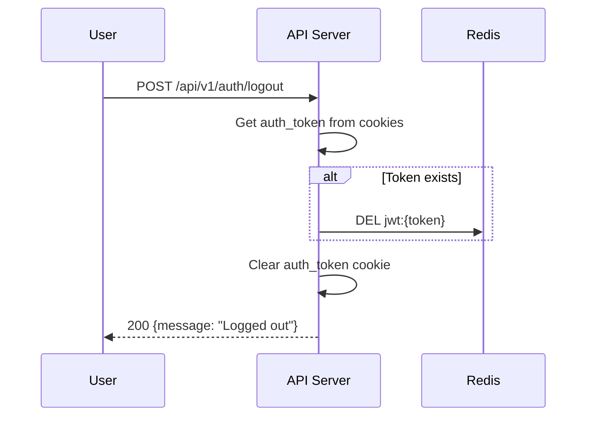

# Logout Flow Documentation

## Sequence Diagram

## Flow Description

1. **Token Retrieval**: Extracts the `auth_token` from the request cookies.
2. **Session Cleanup**: If a token exists, deletes the corresponding session key from Redis.
3. **Cookie Clearing**: Removes the `auth_token` cookie from the client's browser.
4. **Response**: Returns a success message confirming logout.

## Performance Notes

- Total time: ~10ms
- All operations are in-memory (Redis delete, cookie clear), so extremely fast.

## Error Handling

- No token in cookies: Still clears cookie and responds successfully (idempotent).
- Redis errors: Logs error but still clears cookie and responds (graceful degradation).