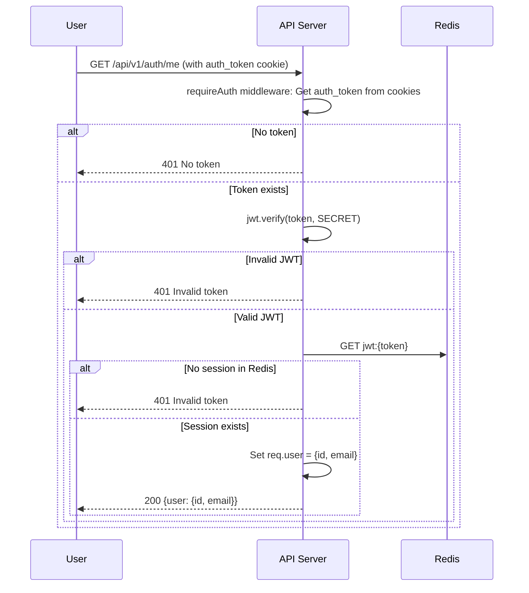

# /me Flow Documentation

## Sequence Diagram

## Flow Description

1. **Middleware Check**: `requireAuth` extracts the `auth_token` from cookies.
2. **JWT Verification**: Validates the JWT signature and expiration.
3. **Session Validation**: Checks if the token exists in Redis (session store).
4. **User Data**: If valid, attaches decoded user data (`id`, `email`) to `req.user`.
5. **Response**: Returns the user object in JSON.

## Performance Notes

- Total time: ~2ms
- Extremely fast: JWT verify (~1ms), Redis GET (~1ms), no DB hits.

## Error Handling

- No token: 401 No token
- Invalid/expired JWT: 401 Invalid token
- - Missing Redis session: 401 Invalid token (handles token reuse/theft)
