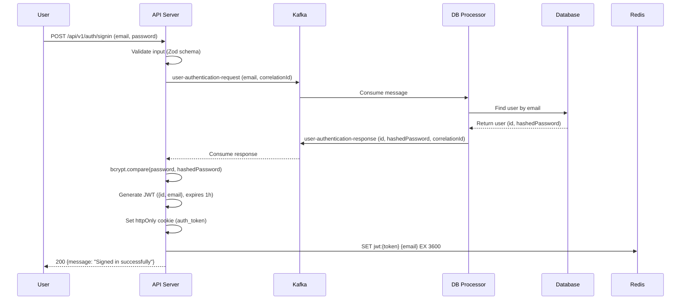

# Signin Flow Documentation

## Sequence Diagram

## Flow Description

1. **Input Validation**: The API server validates the email and password using Zod schema.
2. **User Authentication Request**: Sends a Kafka message to the DB processor to fetch the user's hashed password.
3. **Database Query**: DB processor queries the database for the user by email.
4. **Password Verification**: API server compares the provided password with the hashed password using bcrypt.
5. **JWT Generation**: Creates a JWT token containing user ID and email, expiring in 1 hour.
6. **Cookie Setting**: Sets an httpOnly cookie with the JWT token.
7. **Session Storage**: Stores the token in Redis for session management with 1-hour expiration.
8. **Response**: Returns success message to the user.

## Performance Notes

- Total time: ~200ms
- Bottlenecks: Kafka round-trip (~100-150ms), bcrypt comparison (~50ms)
- Fast components: JWT generation, Redis store, cookie setting (<10ms each)

## Error Handling

- Invalid input: 411 Validation failed
- User not found: 401 Authentication failed
- Wrong password: 401 Invalid password
- Kafka/DB errors: 500 Internal server error
