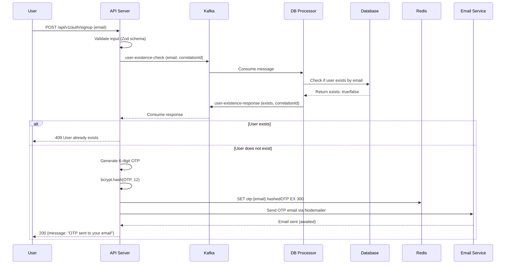

# Signup Flow Documentation

## Sequence Diagram

## Flow Description

1. **Input Validation**: Validates email using Zod schema.
2. **User Existence Check**: Kafka request to DB processor to check if user already exists.
3. **Database Query**: DB processor queries database for existing user.
4. **OTP Generation**: If user doesn't exist, generates a 6-digit OTP.
5. **OTP Storage**: Hashes and stores OTP in Redis with 5-minute expiration.
6. **Email Sending**: Sends OTP via Gmail SMTP (Nodemailer), blocking until sent.
7. **Response**: Confirms OTP sent to email.

## Performance Notes

- Total time: ~3.5s
- Main bottleneck: Email sending (~3-4s via SMTP)
- Fast components: Validation, OTP gen, Redis store (<50ms)

## Error Handling

- Invalid input: 411 Validation failed
- User exists: 409 User already exists
- Kafka/DB errors: 500 Failed to verify user existence
- Email send failure: 500 Internal server error
