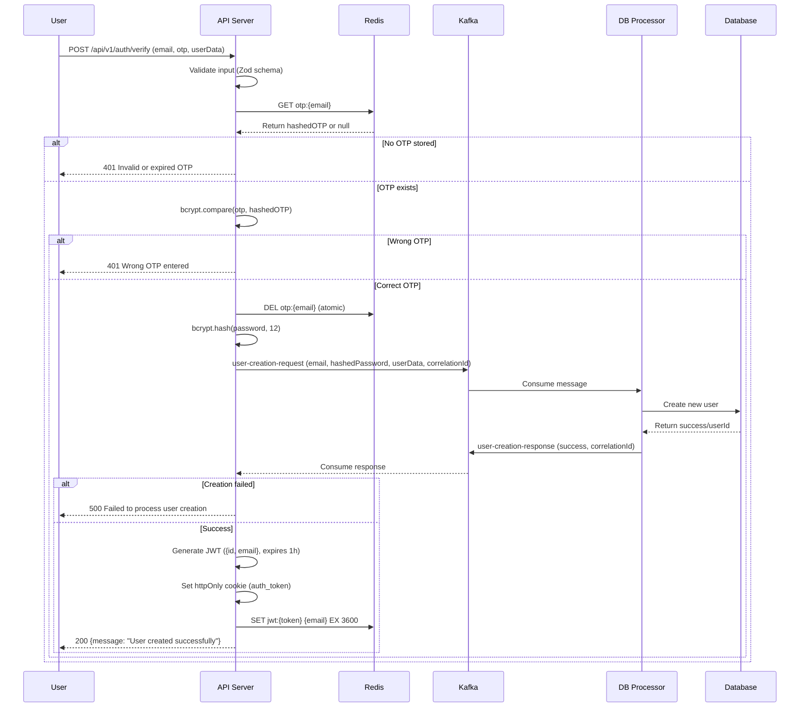

# Verify OTP Flow Documentation

## Sequence Diagram

## Flow Description

1. **Input Validation**: Validates email, OTP, and user data using Zod schema.
2. **OTP Retrieval**: Fetches hashed OTP from Redis.
3. **OTP Verification**: Compares provided OTP with stored hash using bcrypt.
4. **OTP Deletion**: Atomically deletes OTP from Redis to prevent reuse.
5. **Password Hashing**: Hashes the user's password with bcrypt (12 rounds).
6. **User Creation Request**: Sends Kafka message to create user in database.
7. **Database Operation**: DB processor creates the user and returns success.
8. **JWT Generation**: Creates JWT with user ID and email.
9. **Session Setup**: Sets cookie and stores session in Redis.
10. **Response**: Confirms user creation.

## Performance Notes

- Total time: ~270ms
- Fast components: Validation, OTP check, JWT gen, Redis ops (<50ms)
- Moderate: bcrypt operations (~100ms), Kafka round-trip (~150ms)

## Error Handling

- Invalid input: 411 Validation failed
- No/invalid OTP: 401 Invalid or expired OTP
- Wrong OTP: 401 Wrong OTP entered
- OTP already used: 409 This OTP has already been used
- User creation failure: 500 Failed to process user creation
- Kafka/DB errors: 500 Internal server error
